# Dom Manipulation Assignment

1. Webiste Name: [Dev To](https://dev.to/)

### Topics

    - Query Selctory, Inner HTML

### Sample Image


### Tasks

        Target the Top description div and change the DEV Community to <Your_Name> and description to your passion

### Output

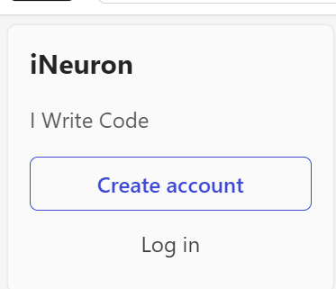

### Solution

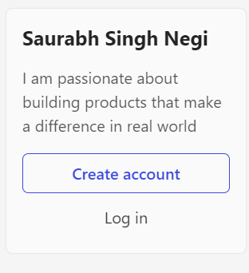

### Code
```javascript
document.querySelector(".side-bar .crayons-card .crayons-subtitle-2").innerHTML = "Saurabh Singh Negi"
document.querySelector(".side-bar .crayons-card .color-base-70").innerHTML = "I am passionate about building products that make a difference in real world"
```

2. Website Name: [Apple](https://support.apple.com/en-in)

### Task


### Fetch all the product name and store in an array

### Output

['iPhone', 'Mac', 'iPad', 'Watch', 'AirPods', 'Music', 'TV']

### Solution

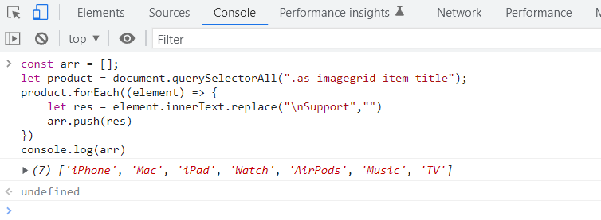

### Code

```javascript
const arr = [];
let product = document.querySelectorAll(".as-imagegrid-item-title");
product.forEach((element) => {
    let res = element.innerText.replace("\nSupport","")
    arr.push(res)
})
console.log(arr)
```

3. Webiste Name: [Youtube Support](https://support.google.com/youtube/)

### Topics

    - Get Element By Id, Create Element, Create Text Node, Append Child

### Sample Image


### Tasks

     Add another FAQ 'My New FAQ' to the list

### Output


### Solution

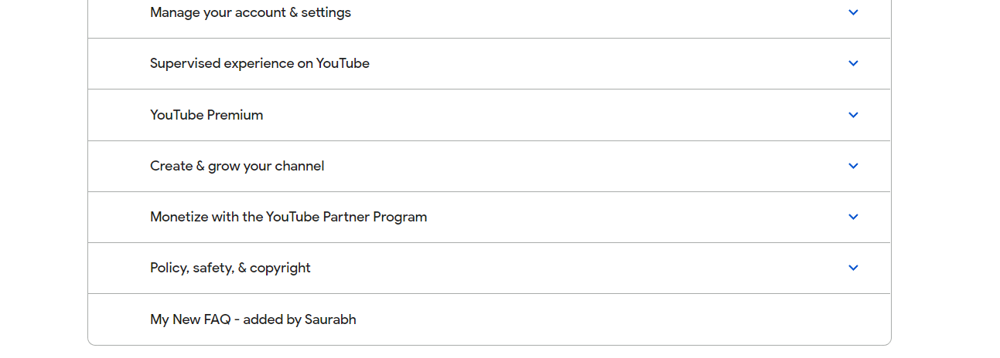

### Code
```javascript
const faq = document.createElement("h3");
const section = document.createElement("section");
section.classList.add("parent");
faq.innerText = "My New FAQ - added by Saurabh";
const container = document.querySelector(".accordion-homepage");
container.appendChild(section);
section.appendChild(faq);
```

4. Webiste Name: [OnePlus](https://www.oneplus.in/support)

### Topics

     Query Selector, InnerText

### Sample Image


### Tasks

      Change the contact number

### Output


### Solution

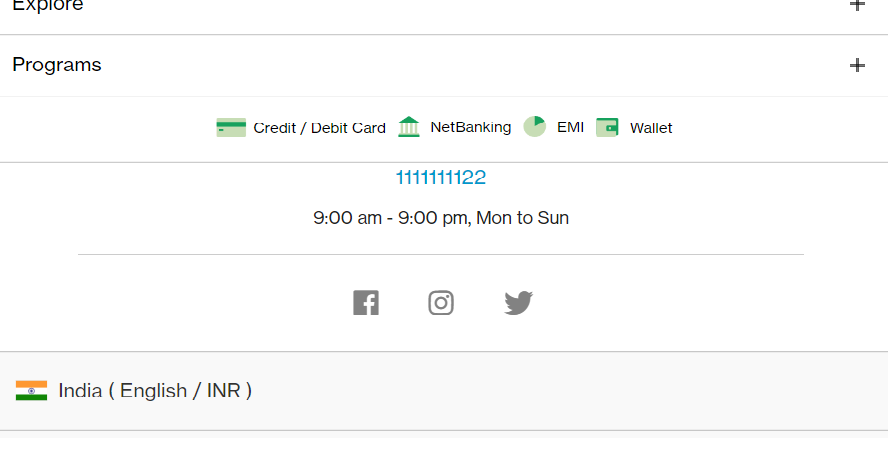

### Code
```javascript
const phone = document.querySelector(".one-tel-number");
phone.innerText = "1111111122";
```


5. Webiste Name: [Samsung](https://www.samsung.com/in/offer/online/samsung-fest/)

### Topics

       getElementById, createElement, InnerText, append, setAttribute

### Sample Image


### Tasks

     Target the main div of card and change the Button text to Check out

### Output


### Solution

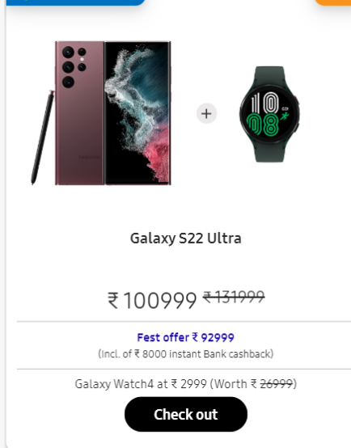

### Code
```javascript
const btn = document.querySelector(".diwali-deals-product-sale-btn");
btn.innerText = "Check out";
```

6. Webiste Name: [Adidas](https://www.adidas.co.in/)

### Topics

    -   Query Selector, Event listeners, Changing Styles

### Sample Image


### Tasks

     Target the search box and on hover change thebackground color to red.

### Output


### Solution

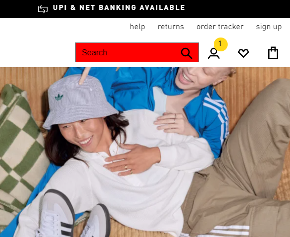

### Code
```javascript
const search = document.querySelector(".searchinput___19uW0");
search.addEventListener("mouseover", () => {
    search.style.backgroundColor = "red";
})
const search_out = document.querySelector(".searchinput___19uW0");
search.addEventListener("mouseout", () => {
    search.style.backgroundColor = "white";
})
```

7. Webiste Name: [MDN Web Docs](https://developer.mo zilla.org/en-US/)

### Topics

       Form, Value, Submit

### Sample Image


### Tasks

     To Search a topic in the MDN Search bar.
     First add a text to search in the search bar and then hit the submit search button to search the docs using DOM

### Output


### Solution

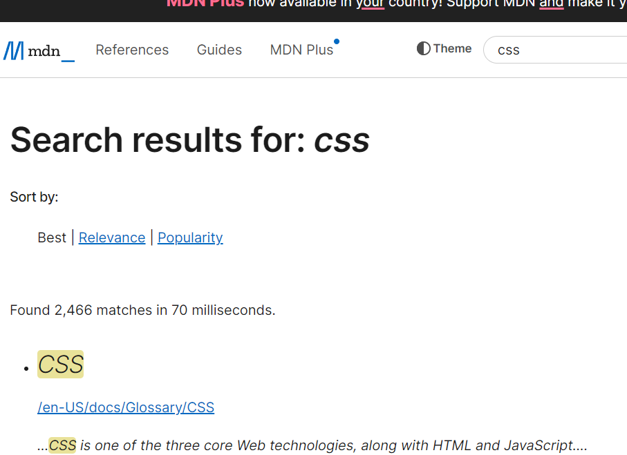

### Code
```javascript
const inp = document.querySelector("#hp-search-input");
inp.value = "css";

const btn = document.querySelector("#hp-search-form");
btn.submit();
```

8. Webiste Name: [Google](https://www.google.com/)

### Topics

       Remove Elements

### Sample Image


### Tasks

     Remove alternate languages from the home page languages listed

### Output


### Solution

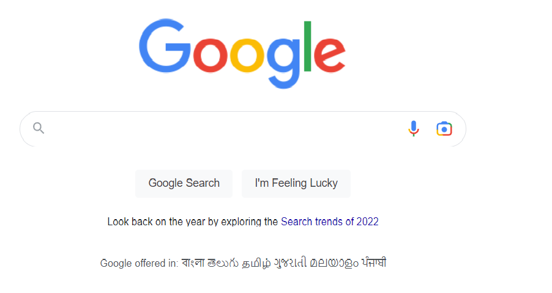

### Code
```javascript
const items = document.getElementById("SIvCob");
let langArr = items.innerText;
langArr = langArr.split(" ");

for(let i=3 ; i<langArr.length; i++) {
    if(i%2 != 0) {
        langArr.splice(i, 1);
    }
}
langArr = langArr.join(" ");
items.innerText = langArr;
```

9. Webiste Name: [Code Wars](https://www.codewars.com/)

### Topics

       Change Font Family, Color of Text.

### Sample Image


### Tasks

    Change the font family of the text to monospace and text color to the logo’s background color.

### Output


### Solution


### Code
```javascript
const text = document.querySelector("h1.text-color-white");
text.style.color = "#FF4D4D"
text.style.fontFamily = 'monospace'
```

10. Webiste Name: [Freecodecamp](https://www.freecodecamp.org/)

### Topics

       querySelector, mouseover, click eventListener,  callback function, style,

### Sample Image


### Tasks

    Target the button and change background colour on mouseover

### Output


### Solution

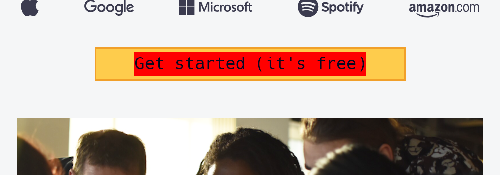

### Code
```javascript
const text = document.querySelector(".btn-cta-big.btn-block.signup-btn.btn-cta.btn.btn-default .login-btn-text");
console.log(text.innerText);
text.addEventListener("mouseover", () => {
    text.style.backgroundColor = "red";
})
text.addEventListener("mouseout", () => {
    text.style.backgroundColor = "#FFB439"
})
```

11. Webiste Name: [realme](https://www.realme.com/in/)

### Topics

       querySelector,style,background-image

### Sample Image


### Tasks

    change the realme logo to ineuron logo

### Output


12. Webiste Name: [Github](https://github.com/)

### Topics

       querySelector,style,background-Color

### Sample Image


### Tasks

     change the background colour of the button to blue.

### Output


### Solution

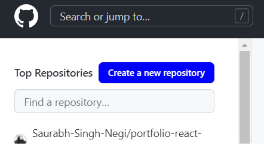

### Code
```javascript
const container = document.querySelector(".js-repos-container a");
container.style.backgroundColor = "blue"
container.style.color = "white"
container.innerText = "Create a new repository"
```

13. Webiste Name: [Hackerrank](https://www.hackerrank.com/)

### Topics

       querySelector,innerHtml

### Sample Image


### Tasks

Target the top description and change “Matching developers with great companies” to ‘JSBOOTCAMP“.

### Output


14. Webiste Name: [Asus](https://www.asus.com/in/)

### Topics

      querySelector,style,font-size

### Sample Image


### Tasks

       change the fontsize of “Hot Deals” to 80px

### Output


15. Webiste Name: [Dell](https://www.dell.com/en-in/shop/deals/laptop-deals?gacd=10415953-9016-5761040-285981356-0&dgc=ST&gclid=Cj0KCQjwguGYBhDRARIsAHgRm4-XUDMhhVNyHXb3s1gY4ZBzORr_d9Se-buhJwy7asyUe7YdqEA11eEaAt6UEALw_wcB&gclsrc=aw.ds&nclid=BxjBlpBQsX6pjSHh-L8YYSU77EpfXRkG1AGMB5Wbeu386ykspfrPDnfx_DdFau20)

### Topics

      querySelector,style.textAlign

### Sample Image


### Tasks

       Convert the text “G15 Gaming Laptop” from left to right

### Output


16. Webiste Name: [Vercel](https://vercel.com/)

### Topics

     querySelector,innerHTMl

### Sample Image


### Tasks

      change the heading “Start with the developer” to “Start with Scratch”

### Output


17. Webiste Name: [Sony](https://www.sony.co.in/)

### Topics

    querySelector,innerHTMl

### Sample Image


### Tasks

     change the button text To current Date.

### Output


18. Webiste Name: [Philips](https://www.philips.co.in/)

### Topics

     querySelector,style,backgroundcolor

### Sample Image


### Tasks

    change the background colour blue to orange

### Output


19. Webiste Name: [Canon](https://in.canon/)

### Topics

          querySelector,src

### Sample Image


### Tasks

    extract the canon logo

### Output


20. Webiste Name: [Oppo](https://www.oppo.com/in/)

### Topics

          querySelector,style,color

### Sample Image

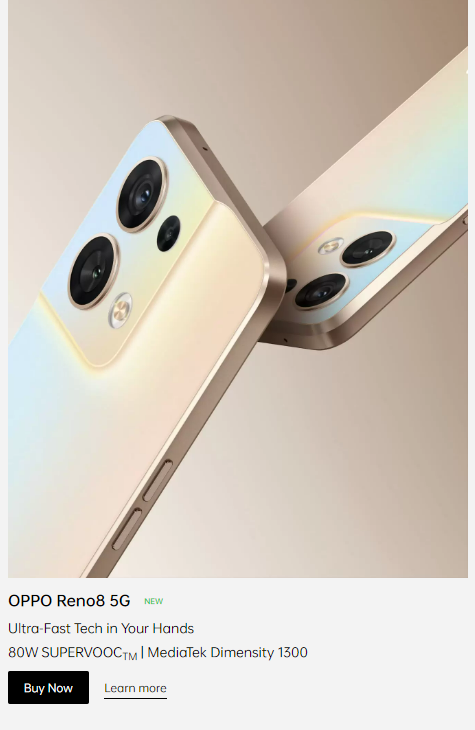

### Tasks

      Change the description colour black to orange

### Output


